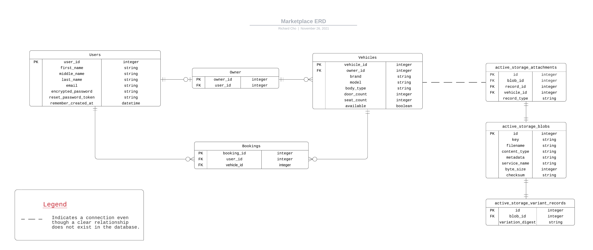

# T2A2 Marketplace App - Wildspeed Car Sharing


Available at: https://wildspeed.herokuapp.com/

GitHub repo: https://github.com/Ryuukishi/Marketplace


## R7 Identification of the *problem* you are trying to solve by building this particular marketplace *app*


According to the latest statistics from the Australian Bureau of Statistics, 37% of people with jobs worked from home at least once a week compared to pre-COVID19 retrictions began early last year in 2020[^1]. Similarly, there's been an overall increase in other activities such as staying at home and getting home deliveries for items such as food, groceries and household products. Therefore, the overall trend is that many people are using their cars less and less. Cars are an asset and if it's sitting in your garage unused, why not rent it out and earn some extra money? Our app aims to provide users with this opportunity by letting them rent their cars out as part of a car sharing network. 

[^1]: https://www.abs.gov.au/statistics/people/people-and-communities/household-impacts-covid-19-survey/latest-release


## R11 

### Purpose

Wild Speed is a car sharing network that operates as a two-sided marketplace that allows users to rent out their cars for other users to rent. The goal is to build up a large community of users who will help to expand and grow the network of cars all across Australia and compete with other car sharing apps such as GoGet and Car Next Door.


### Functionality / features

**User accounts:** By default some portions of the site will be unaccessible unless they register for an account and log in to the app. By creating an account, users can access the full functionality of the website including renting and listing cars.

**Listing:** Users can list their cars for rent on the app. Users can create a new listing by filling in a form with information about their vehicle such as: brand, model, body style, no. of doors/seats and so on. Once a user has listed their vehicle up for rent, they can manage their vehicle by performing operations such as updating information about the vehicle and also the ability to delete the listing. 

**Booking:** A core component of this app, along with the ability to list your car for rent, is the ability to book a car and rent it. The booking system allows you to view and manage all your bookings in a separate page for easy access.  Once a user is finished with renting the car they can then delete the booking and the car will be available again for rent. 


### Sitemap


External link: https://lucid.app/lucidchart/e7eb47bf-aae8-42d1-a230-ef49148fc1c8/edit?viewport_loc=-597%2C-13%2C3282%2C1702%2C0_0&invitationId=inv_addf7711-f1ce-4a1f-98d9-77a58c3b8411


### Screenshots


### Target audience

The overall target audience is people who work from home and especially people who have jobs that allow for frequent remote work such as IT professionals like web developers and software engineers. As noted above, people working in these industries tend to work from home often which allows them the opportunity to rent out their vehicles to other users on the app. 


### Tech stack

**Front End:** 

- HTML - Used to structure the web pages and its content
- CSS - Used to style the web page and positioning objects within the page
- Bootstrap - JavaScript and CSS framework that allows us to easily specify pre-built styling to and offers functionality such as modals and interactive buttons

**Back End:** 

- Ruby/Ruby on Rails - Web-application framework that links the front end to the back end. The app's main CRUD functionality and other business logic is written in Ruby using the Rails framework. 

**Additional Gems:** 

- Devise - Ruby gem offering a complete user authentication package.
- Faker - Ruby gem allowing users to populate (seed) fake data into their database for testing purposes. 

**Database:** 

- PostgreSQL - An industry standard database management system. 

**Deployment:** 

- Heroku - Cloud hosting platform used to host the app.

**Active Storage and Image Hosting**:

- Amazon AWS S3 - FIle hosting solution for user uploads.

**Version Control:** 

- Git - Industry standard version control management software for tracking changes.
- GitHub - Popular cloud repository platform. 


## R12 User stories


**User accounts and authorisation**:

- As a site visitor, I want to be able to create an account and access full functionality of the app.
- As a user, I want to be able to sign in and sign out.
- As a user, I want to be able to reset my password.
- As a user, I want to be able to pages that displays information about me, vehicles that I've listed or my bookings.
- As a user, I don't want other users to view information about me, or my bookings.
- As a user, I don't want other users to be able to edit my listings or delete my vehicles.

**Listings:**

- As a user or site visitor, I want to be able to see a listing of all the cars that are available on the app.
- As a user, I want to be able to see detailed information about a specific car.
- As a user, I want to be able to create new listings and upload information about my car along with pictures.
- As a user I want to be able to edit my listings.
- As a user I want to be able to delete my listings.

**Bookings:**

- As a user I want to be able to book cars on the app.
- As a user I want to be able to view my current bookings.
- As a user I want to be able to delete my bookings. 


## R13 Wireframes


## R14 ERD



External link: https://lucid.app/lucidchart/bf8c3f8b-cf46-40dc-a11c-fa9831a3c350/edit?invitationId=inv_45f9ca23-6aa0-4e19-95ef-d554f899d5c1&page=0_0#


## R15 Explain the different high-level components (abstractions)


The core foundation of the app is built using the Ruby on Rails framework which uses the Model-View-Controller architecture which separates the app's functionality and logic into three distinct layers. The front end user interface is represented by the Views layer. It handles everything the users sees and interacts with through the browser. The Views layer is designed to have little to no logic at all as that is mostly handled by the Controller. The Controller layer is the middle man that handles most of the business logic by communicating with the Model and telling the Views what to display on the screen. 

In our app, the Controller plays a vital role in managing user requests and when accessing or manipulating data from the Model. Whenever a user clicks a link, presses a button, submits a form etc, these requests are handled directly by the Controller. For example, if a user is on the home page and clicks on a link to see the listings page, the Controller handles this request by routing it to the desired page, processing the relevant data from the Model and sending it back to the user via Views. 

Lastly, the Model layer represents the interface between the app and the PostgreSQL (PSQL). Along with managing and storing all the data in our app, one of the Model's main functions is CRUD: the creating, reading, updating and deleting of data and objects. The data is passed to the Controller which in turn processes it before sending it over to Views for display. The Model also has an important job in managing the relationship between individual tables in the database. These relationships are important for our app when creating a two-sided marketplace. Additionally, we can also perform data validations and checks to ensure the data that's coming into our database is the correct type and format. An example of this is when we create a new listing for a vehicle. When the user inputs information about the vehicle in the form and submits it, the Model will do a validation check to make sure certain fields aren't left blank or that the data is within a certain range.

Other abstractions that are present in the app include user authentication and authorisation which is managed mainly by the Devise gem and some Ruby code. This is all done in the background for privacy and security reasons. This ensures that a user can't access another user's bookings or another user can't update or delete another user's listings.


## R16 Detail any third party services that your *app* will use


- **Heroku:** Heroku is a cloud hosting platform that enables developers to build, run, and operate applications entirely in the cloud.
- **Amazon AWS S3**: S3 is a cloud storage service that allows an app to store content such as files, static assets and user uploads. For this app, we will be taking advantage of S3 to primarily host user submitted images of their cars.
- **GitHub**: GitHub is a cloud repository hosting platform which is used to store a remote copy of the app's source code.


## R17 Describe your projects *models* in terms of the relationships (active record associations) they have with each other


```ruby
class User < ApplicationRecord
  devise :database_authenticatable, :registerable,
         :recoverable, :rememberable, :validatable
  has_one :owner
  has_many :bookings
  has_many :vehicles, through: :bookings
end		
```

The User model has a one-to-one relationship with the Owner model. Each user can only be related to one user.  A separate Owner model is necessary in our app because even though it is a two-sided marketplace, the ownership of the vehicle does not change hands and therefore it will be difficult to track who owns which vehicle, especially when making bookings. Additionally, there is a many-to-many relationship between the Vehicle model. The two models are joined together by the Booking model. This allows a user to make many bookings consisting of multiple vehicles.


```ruby
class Owner < ApplicationRecord
  belongs_to :user, optional: true
  has_many :vehicles
end
```

The Owner model belongs to the User model with which it has a one-to-one relationship. The relationship is stated as being optional because a user isn't technically an owner until they list a vehicle for rent. The Owner model also has a one-to-many relationship with the Vehicle model. This is because a user (owner) can own many vehicles but a vehicle can only belong to one user (owner).


```ruby
class Vehicle < ApplicationRecord
  has_one_attached :image
  belongs_to :owner
  has_many :bookings
  has_many :users, through: :bookings
end
```

The Vehicle model belongs to the Owner to which it has a one-to-many relationship. An owner can own many vehicles. Additionally it has a many-to-many relationship with the User model through the Booking model which as a joining table. Additionally, there isn't a "relationship" between the Vehicle model and Active Storage as there are no Foreign Keys present in either table, but there is a connection nevertheless as `has_one_attached :image` allows users to upload images of their vehicles which will then be stored in Active Storage (AWS S3).


```ruby
class Booking < ApplicationRecord
  belongs_to :user
  belongs_to :vehicle
end
```

Lastly, the Booking model acts to join the User model and Vehicle model together. A user can make book many vehicles and a vehicle can be booked by many users. 


## R18 Discuss the database relations to be implemented in your application


In order to establish the relationships between different models specified above, we can relate to each model using Foreign Keys. Generally, a Foreign Key in one table is a Primary Key in the corresponding table with which it is related to i.e. using the above example, the Owner model has a Foreign Key of `user_id` which establishes a relation between Owner and User. Likewise, in the Vehicle model there is a Foreign Key of `owner_id` which links it to the Owner model. And because Booking is a joining table that joins two models together, it has two Foreign Keys: `user_id` and `vehicle_id` which is used to establish the many-to-many relationship between User and Vehicle *through* Booking. This can be seen visually in the provided ERD.

To summarise, including a Foreign Key in a table establishes a relationship between the two tables. However this doesn't specify *what* kind of relationship these two tables have, e.g. one-to-one, one-to-many etc. The type of relationship is only specified in the model itself.


## R19 Provide your database schema design


### Active Storage Attachments

```ruby
  create_table "active_storage_attachments", force: :cascade do |t|
    t.string "name", null: false
    t.string "record_type", null: false
    t.bigint "record_id", null: false
    t.bigint "blob_id", null: false
    t.datetime "created_at", null: false
    t.index ["blob_id"], name: "index_active_storage_attachments_on_blob_id"
    t.index ["record_type", "record_id", "name", "blob_id"], name: "index_active_storage_attachments_uniqueness", unique: true
  end
```

### Active Storage Blobs

```ruby
  create_table "active_storage_blobs", force: :cascade do |t|
    t.string "key", null: false
    t.string "filename", null: false
    t.string "content_type"
    t.text "metadata"
    t.string "service_name", null: false
    t.bigint "byte_size", null: false
    t.string "checksum", null: false
    t.datetime "created_at", null: false
    t.index ["key"], name: "index_active_storage_blobs_on_key", unique: true
  end
```

### Active Storage Variant Records

```ruby
  create_table "active_storage_variant_records", force: :cascade do |t|
    t.bigint "blob_id", null: false
    t.string "variation_digest", null: false
    t.index ["blob_id", "variation_digest"], name: "index_active_storage_variant_records_uniqueness", unique: true
  end
```

### Bookings

```ruby
  create_table "bookings", force: :cascade do |t|
    t.bigint "user_id", null: false
    t.bigint "vehicle_id", null: false
    t.datetime "created_at", precision: 6, null: false
    t.datetime "updated_at", precision: 6, null: false
    t.index ["user_id"], name: "index_bookings_on_user_id"
    t.index ["vehicle_id"], name: "index_bookings_on_vehicle_id"
  end	
```

### Owners

```ruby
  create_table "owners", force: :cascade do |t|
    t.bigint "user_id", null: false
    t.datetime "created_at", precision: 6, null: false
    t.datetime "updated_at", precision: 6, null: false
    t.index ["user_id"], name: "index_owners_on_user_id"
  end
```

### **Users**

```ruby
  create_table "users", force: :cascade do |t|
    t.string "email", default: "", null: false
    t.string "encrypted_password", default: "", null: false
    t.string "reset_password_token"
    t.datetime "reset_password_sent_at"
    t.datetime "remember_created_at"
    t.datetime "created_at", precision: 6, null: false
    t.datetime "updated_at", precision: 6, null: false
    t.string "first_name"
    t.string "middle_name"
    t.string "last_name"
    t.index ["email"], name: "index_users_on_email", unique: true
    t.index ["reset_password_token"], name: "index_users_on_reset_password_token", unique: true
  end
```

### Vehicles

```ruby
  create_table "vehicles", force: :cascade do |t|
    t.string "brand"
    t.string "model"
    t.string "body_type"
    t.integer "door_count"
    t.integer "seat_count"
    t.boolean "available"
    t.bigint "owner_id", null: false
    t.datetime "created_at", precision: 6, null: false
    t.datetime "updated_at", precision: 6, null: false
    t.index ["owner_id"], name: "index_vehicles_on_owner_id"
  end
```


## R20 Describe the way tasks are allocated and tracked in your project


Tasks will be tracked using Jira. It provides a visual timeline for tracking project timeline and due dates.


